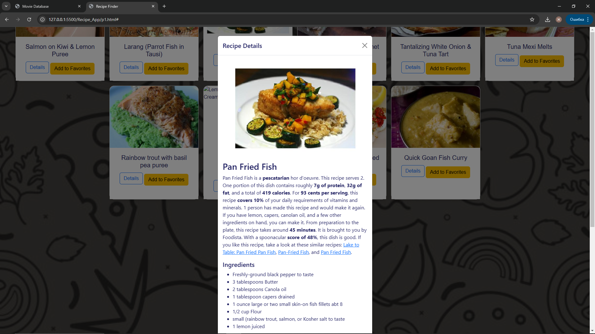

# Movies App

## Project Overview
The **Movies App** is a web application that lets users search for and view details about movies. It connects to an external API to retrieve information such as movie titles, posters, genres, ratings, and descriptions. This app provides an intuitive and fast way for users to discover movie details with ease.

## Key Features
- **Movie Search**: Enter a movie title to find and display detailed information.
- **Ratings and Descriptions**: View movie ratings, genres, and brief descriptions.
- **Filtering Options**: Filter movies by genre or rating to narrow down search results.
- **Watchlist**:You can add movies for your list and watch later 

## Screenshots
Below are some screenshots of the Movies App in action.

### Movie Search

### Filter Options

### Watchlist

### Main Page

# Recipe_App
## Project Overview
The **Recipe app** is a web application that allows users to search for recipes, view random meal suggestions, and save their favorite meals. It connects to an external recipe API to retrieve detailed information about various dishes, including ingredients and preparation instructions.

## Key Features
- **Random Meal Suggestions**: Displays a set of random meals to inspire the user.
- **Meal Search**: Allows users to search for specific meals by name.
- **Autocomplete Suggestions**: Provides real-time suggestions while typing to help refine searches.
- **Favorite Meals**: Users can mark meals as favorites and view them in a dedicated section.
- **Detailed Recipe View**: Clicking on a meal opens a modal with full recipe details, including ingredients and steps.

## Screenshots
Below are some screenshots of the Recipe Finder in action.

### Random Meal Suggestions

### Meal Result

### Meal Result with Autocomplete

### Favorite Meals

### Recipe Details Modal

# Weather App

## Project Overview
The **Weather App** is a web application that provides current weather information for any city around the world. It allows users to search for a city's weather, view the current temperature, and receive a 5-day forecast. Additionally, it offers the option to switch between Celsius and Fahrenheit units and access weather data based on their current location.

## Key Features
- **City Weather Search**: Users can search for weather information by typing a city name.
- **Current Location Weather**: The app can automatically fetch the weather for the user's current location.
- **Temperature Unit Toggle**: Users can toggle between Celsius and Fahrenheit for temperature display.
- **Weather Forecast**: A 5-day weather forecast is displayed for the selected city.
- **City Suggestions**: As users type, the app suggests possible city names.

## Screenshots
Below are some screenshots of the Weather App in action.

### City Search

### Current Location Weather

### 5-Day Forecast

### Temperature Unit Toggle

## Technologies Used
- **HTML, CSS, JavaScript**: For structure, styling, and interactive functionality.
- **OpenWeatherMap API**: Fetches weather data, including current conditions and forecasts.
- **Geolocation API**: Used to detect the user's current location.
- **Bootstrap**: Used for responsive design and UI components like modals and buttons.
- **External Recipe API**: Fetches recipe details and random meals.
- **API Integration**: Uses an external API to fetch and display movie information.

## Setup and Installation
